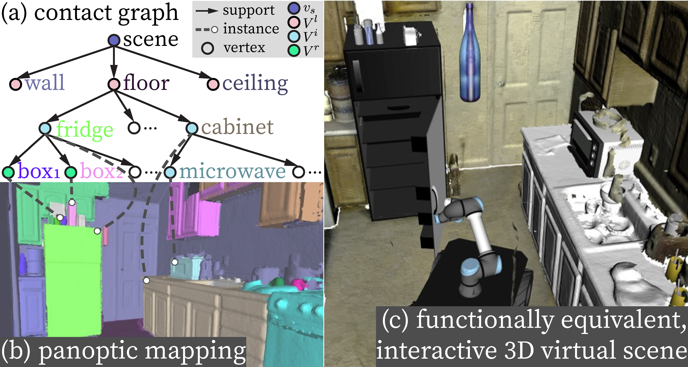

# Interactive Scene Reconstruction


### [Project Page](https://sites.google.com/view/icra2021-reconstruction) | [Paper](https://arxiv.org/pdf/2103.16095.pdf) 
<p align="center">
  
</p>


This repository contains the implementation of our ICRA2021 paper [Reconstructing Interactive 3D Scenes by Panoptic Mapping and CAD Model Alignments](https://sites.google.com/view/icra2021-reconstruction). 
The proposed pipeline reconstructs an interactive indoor scene from RGBD streams, where objects are replaced by (articulated) CAD models. Represented as a contact graph, 
the reconstructed scene naturally encodes actionable information in terms of environmental kinematics, and can be imported into various simulators to support robot interactions.

The pipeline consists of 3 modules:
- A robust panoptic mapping module that accurately reconstruct the semantics and geometry of objects and layouts, which is a modified version of [Voxblox++](https://github.com/ethz-asl/voxblox-plusplus) but with improved robustness. The 2D image segmentation is obtained using [Detectron2] (https://github.com/facebookresearch/detectron2)
- An object-based reasoning module that constructs a contact graph from the dense panoptic map and replaces objects with aligned CAD models
- An interface that converts a contact graph into a kinematic tree in the URDF format, which can be imported into ROS-based simulators


## Todo

- [x] Upload code for panoptic mapping
- [ ] Upload code for CAD replacement
- [ ] Upload code for URDF conversion and scene visualization
- [ ] Upload dataset and use cases
- [ ] Update instructions


## 1. Installation
---

### 1.1 Prerequisites

- Ubuntu 16.04/18.04/20.04 with compatible ROS version
- Python >= 3.7
- gcc & g++ >= 5.4
- OpenCV 3 or 4
- Nvidia GPU (with compatible cuda toolkit and cuDNN) if want to run online segmentation
- Anaconda for configuring python dependencies

### 1.2 Clone the repository & install catkin dependencies

First create and navigate to your catkin workspace

``` shell
cd <your-working-directory>
mkdir <your-ros-ws>/src && cd <your-ros-ws>
```

Then, initialize the workspace and configure it. (Remember to replace <your-ros-version> by your ros version)

``` shell
catkin init
catkin config --extend /opt/ros/<your-ros-version> --merge-devel 
catkin config --cmake-args -DCMAKE_CXX_STANDARD=14 -DCMAKE_BUILD_TYPE=Release
```
  
Download this repository to your ROS workspace `src/` folder with submodules via:

``` shell
cd src
git clone --recursive https://github.com/hmz-15/Interactive-Scene-Reconstruction.git
```

Then add dependencies specified by .rosinstall using wstool

``` shell
cd Interactive-Scene-Reconstruction
mkdir dependency && wstool init dependency && cd dependency
wstool merge -t . ../dependency_https.rosinstall
wstool update
```

### 1.3 Install python dependencies

We assume using [conda virtual environment](https://conda.io/projects/conda/en/latest/user-guide/tasks/manage-environments.html#activating-an-environment) to configure python dependencies. This requires [Anaconda](https://www.anaconda.com/products/individual) to be installed and initialized as prerequisite. We create a conda env with `python3.7` and install the dependencies:

``` shell
conda create --name robot-scene-recon python=3.7 -y
conda activate robot-scene-recon
pip install pip --upgrade

cd <your-ros-ws>/src/Interactive-Scene-Reconstruction
# detectron2 dependencies
pip install torch torchvision
python -m pip install detectron2 -f \
  https://dl.fbaipublicfiles.com/detectron2/wheels/cu102/torch1.10/index.html
# other dependencies
pip install -r requirements.txt
```

Note that you may need to adjust the version of [torch, torchvision](https://pytorch.org/) and [detectron2](https://detectron2.readthedocs.io/en/latest/tutorials/install.html) based on your cuda/cuDNN version.

You can deactivate the conda env using:
``` shell
conda deactivate
```


### 1.4 Build packages

We first build the python package containing panoptic segmentation server.
``` shell
cd Interactive-Scene-Reconstruction/mapping/rp_server
make dev
```

Then we build the ros packages with `catkin build`.
``` shell
cd <your-ros-ws>
# Build packages for panoptic mapping
catkin build panoptic_mapping_pipeline -j2
source devel/setup.bash
```
Please replace `bash` by `zsh` if `zsh` is your default shell.
  
## 2. Robust Panoptic Mapping
---
The robust panoptic mapping module is implemented in the `mapping` folder. The folder contains 4 ros packages and 1 python package:

- **panoptic_mapping_pipeline** : provides launch files and usages of the pipeline
- **perception_ros** : image segmentation client and generates per-frame point cloud segments
- **voxblox-plus-plus** : the robust panoptic mapping backend modified based on the original [voxblox++](https://github.com/ethz-asl/voxblox-plusplus)
- **orb_slam_2_ros** : the RGBD SLAM package to compute camera poses when no ground truth camer pose is available, adapted from [orb_slam_2_ros](https://github.com/appliedAI-Initiative/orb_slam_2_ros)

- **rp_server** : python3-based image panoptic segmentation server based on [Detectron2](https://github.com/facebookresearch/detectron2)

Please refer to the launch files under `mapping/panoptic_mapping_pipeline/launch/` for detailed usages and options.


### 2.1 SceneNN dataset

First launch the python3-based image segmentation server in one terminal. Please make sure you activate the conda env beforehand. The server is successfully launched when "Server launched at 0.0.0.0:8801" shows up.

``` shell
conda activate robot-scene-recon
cd Interactive-Scene-Reconstruction/mapping/rp_server
python launch_detectron_server.py
```

Then we launch the ros nodes as:
``` shell
roslaunch panoptic_mapping_pipeline scenenn_pano_mapping.launch
```

Finally we run an example rosbag of a SceneNN dataset sequence (dowloaded [here](http://robotics.ethz.ch/~asl-datasets/RAL-2019-voxblox-plusplus/scenenn_231/scenenn_231.bag))

``` shell
rosbag play -r 0.5 scenenn_231.bag
```

When the mapping process ends, call the following two ros services to save the mesh of segmented scene and panoptic segments:
``` shell
rosservice call /gsm_node/generate_mesh
rosservice call /gsm_node/extract_instances
```

The output will be given in the `output` folder under the root directory.